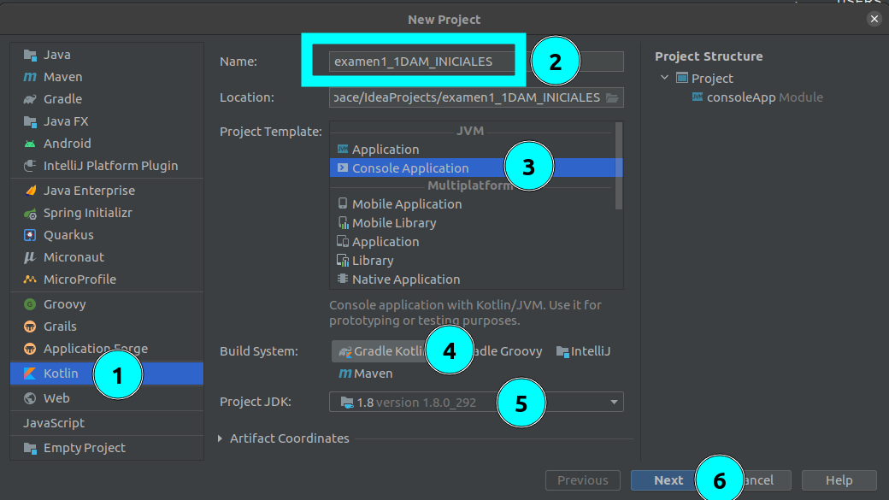

# Examen 1
## ¿Qué se evalúa?
Se evaluará cada uno de los CE del RA1 y RA3 (Los criterios de evaluación están al comiendo de la unidad 1 y 2)
> **RA1**: *Conoce la estructura de un programa informático, identificando y relacionando los elementos propios del lenguaje de programación utilizado.*

> **RA3**: *Escribe y depura código, analizando y utilizando las estructuras de control del lenguaje.*

Los contenidos que abordaremos durante el ejercicio:
- Creación de un proyecto, haciendo uso del IDE.
- Usar distintos tipos de variables, constantes y literales
- Hacer uso de expresiones y operadores según los tipos del lenguaje, haciendo uso de las conversiones.
- Comentar el código.
- Uso de estructuras de repetición y selección
- Uso de control de excepciones
- Depurar y comentar código.
---
## Descripción del examen: Tabla de multiplicar
El *CEIP Profesor Juan Carlos Aragón* está probando un nuevo método para enseñar las tablas de multiplicar al alumnado. Ha solicitado ayuda al *IES Rafael Alberti* para que desarrolle una aplicación que cumpla con los siguientes requisitos:

El método se basa en la técnica divide y vencerás, y consiste en dividir el esfuerzo, poniendo el foco, durante un intervalo de tiempo, en un conjunto de tablas.
La división del esfuerzo se realiza de la siguiente forma:

| Por edades  |  ¿Que tablas estudian? |  Tablas de los meses pares | Tablas de los meses impares
|---|---|---|---|
|  Mayores de 10 años hasta 12 incluido | Tablas del 11 hasta el 13  | 11,12,13 | 11,12,13 | 
|  Mayores de 8 años hasta los 10 incluidos | Tablas del 6 hasta el 10  | 6,8,10 | 7,9 |
|  Mayores o iguales a 6 hasta los 8 incluidos | Tablas del 1 hasta el 5  | 2, 4 | 1, 3, 5 |

Por tanto, para la entrada `8, 12`, el programa mostrará la siguiente salida:
~~~
*********************************************************************************
PROGRAMA DE GENERACIÓN DE TABLAS: <NOMBRE DEL ALUMNO>
̣̣̣_________________________________________________________________________________
Edad: 8. El alumno está dentro del rango [6-8]
Mes: 12. El mes es par, corresponden las tablas siguientes: {2,4}
̣̣̣_________________________________________________________________________________

TABLA DEL 2
***********
2 x 1 = 2
2 x 2 = 4
...
2 x 10 = 20

TABLA DEL 4
***********
4 x 1 = 4
4 x 2 = 8
...
2 x 10 = 40
*********************************************************************************

~~~
Si el rango de edad no se contempla o no es correcto el mes, el programa terminará mostrando los siguientes mensajes, por ejemplo:

para la entrada `15, 3`, la salida será:
~~~
*********************************************************************************
PROGRAMA DE GENERACIÓN DE TABLAS: <NOMBRE DEL ALUMNO>
̣̣̣_________________________________________________________________________________
Edad: 15. No se cotempla esta edad.
̣̣̣_________________________________________________________________________________
*********************************************************************************
~~~
para la entrada `8, 13`, la salida será:
~~~
*********************************************************************************
PROGRAMA DE GENERACIÓN DE TABLAS: <NOMBRE DEL ALUMNO>
̣̣̣_________________________________________________________________________________
Mes: 12. El mes es erroneo.
̣̣̣_________________________________________________________________________________
*********************************************************************************
~~~

## ¿Qué se pide?
Realizar un programa que satisfaga las necesidades del *CEIP Profesor Juan Carlos Aragón*, basándose en los siguientes criterios de evaluación:
- **[20]** El programa hace lo que se pide.
- **[20]** El programa usa estructuras de repetición y selección adecuadas para la resolución.
- **[15]** El programa usa tipos de variables, constantes y literales adecuadamente.
- **[15]** El programa usa expresiones y operadores adecuados al problema para su resolución. 
- **[10]** El código fuente está bien comentado.
- **[5]** Se usa un IDE y Gradle para la creación del proyecto.
- **[5]** El programa gestiona los posibles errores, gestión de excepciones.
- **[5]** El código fuente está bien estructurado haciendo uso de funciones
- **[5]** El código fuente es eficiente

## ¿Qué vamos a hacer?
### Está permitido
- El uso de internet.
- El uso de manuales y documentación adicional.
### Recuerda
- Márcate objetivos pequeños, crea el código y pruébalo.
- Ve poco a poco y prueba las cosas que haces antes de pasar a la siguiente.
- El código no tiene que estar perfecto, siempre se puede modificar a posteriori.
- Usa el depurador si te atascas.
### Crear, realizar y entregar el examen
1. Crea el proyecto usando el IDE:
    - Opción del Menú: `File` -> `New` -> `Project...` y siguen los pasos indicados aquí:
    
    - Sigue los pasos hasta crear el proyecto. 
2. Realiza el examen: Ayuda para plantear el examen:
    - Lee la entrada, recuerda que es: `<edadDelAlumno> <mesEnElQueSeEsta>`
    - Comprueba que la entrada es correcta, si no el programa termina mostrando mensaje.
      - `<edadDelAlumno>` tiene que estar en los rangos permitidos.
      - `<mesEnElQueSeEsta>` tiene que ser un número válido: 1-12.
    - Muestra por pantalla en función de las especificaciones indicadas: 
      - Se tiene en cuenta la edad del alumno y el mes en el que se está.
3. Comparte el proyecto:
    - Opción de Menú: `VCS` -> `Share Project on GitHub`.
      - Deja todo tal como esta. 
      - Pulsa en `Share`
    - Visita tu cuenta de GitHub 
      - Copia la URL del repositorio que acabas de crear.
      - Comparte en la tarea del examen de la moodle la url de tu repositorio.
    - Desde GitHub, puedes añadirme también como colaborador en ese repositorio.

## Solución
~~~ kt
....

~~~